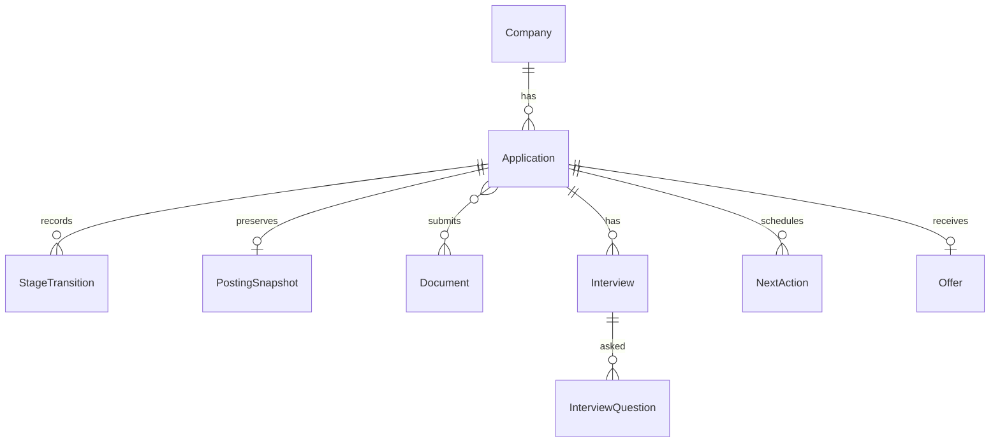

# JobLog — 기획서 (PRD)

구직 활동을 한 곳에서 기록·추적하는 개인용 지원 관리 도구.

> 용어는 [CONTEXT.md](../CONTEXT.md)의 정의를 따른다.

## 1. 문제 정의

구직 활동 기록은 보통 스프레드시트, 메모 앱, 메일함에 흩어져 있고, 그 결과:

- **공고 원문이 소실된다.** 공고는 마감되면 내려간다. 면접 직전에 "그 공고에 뭐라고 써 있었지?"를 확인할 방법이 없다.
- **어떤 이력서 버전을 냈는지 모른다.** 면접관은 내가 제출한 그 버전을 보고 질문하는데, 정작 나는 어떤 버전을 냈는지 기억나지 않는다.
- **면접 경험이 휘발된다.** 받은 질문은 다음 면접의 대비 자산인데 기록되지 않고 사라진다.
- **판단이 감에 의존한다.** 서류에서 떨어지는지 면접에서 떨어지는지 데이터가 없으니, 무엇을 고쳐야 할지 알 수 없다.
- **팔로업을 놓친다.** 무응답 상태로 방치된 지원이 얼마나 오래됐는지 아무도 알려주지 않는다.

## 2. 목표 / 비목표

**목표**

- 지원 한 건의 전 생애주기(지원 → 종결)를 한 곳에서 추적한다.
- 지원 시점의 맥락(공고 원문, 제출 문서 버전)을 보존한다.
- 면접 경험을 재사용 가능한 자산(질문 은행)으로 축적한다.
- 단계별 전환율로 병목을 데이터로 드러낸다.

**비목표 (1차 범위에서 제외)**

- 멀티유저 서비스화 — 이 앱은 싱글유저 도구다.
- 공고 자동 크롤링 — 채용 플랫폼의 로그인월·동적 렌더링 때문에 신뢰도가 낮다. 스냅샷은 수동 붙여넣기로 수집한다.
- 웹푸시 알림 — ICS 캘린더 연동과 이메일로 대체한다.

## 3. 사용자와 배포 형태

- **싱글유저 배포 웹앱.** 실제 URL로 배포되어 데스크톱·모바일 브라우저에서 사용한다.
- 인증은 로그인 + **허용된 계정 화이트리스트**. 배포되어 있어도 타인은 데이터에 접근할 수 없다.
- UI 언어는 한국어.

## 4. 기능 정의

### 4.1 지원 파이프라인 칸반

- 컬럼은 진행 단계(Stage): **지원함 → 서류 → 과제 → 면접 → 오퍼**. 드래그앤드롭으로 이동한다.
- 종료(탈락·철회·수락)는 컬럼이 아니라 **결과(Outcome)** 로 분리한다. 종료된 지원은 마지막 단계 정보를 보존한 채 아카이브로 빠진다. → "서류에서 탈락"이 데이터로 남는다.
- 회사에 따라 일부 단계(예: 과제)는 건너뛸 수 있다.
- 카드에는 현재 단계 **체류 일수**를 표시한다("서류 12일째"). 근거는 단계 전환(Stage Transition) 기록.

### 4.2 공고 스냅샷 아카이빙

- 지원 등록 시 공고 본문을 붙여넣어 저장한다. 원본 URL·저장 시각을 메타로 남긴다.
- 수정은 허용하되, "지원 시점 원문 보존"이 목적임을 UI에 명시한다.
- 지원당 스냅샷 하나. 재지원하면 새 지원에 새 스냅샷을 남긴다.

### 4.3 제출 문서 라이브러리 (이력서 버전 매핑)

- 이력서·포트폴리오·자기소개서 등을 버전명·파일·메모와 함께 독립 라이브러리로 관리한다.
- 지원 건에 여러 문서를 연결한다(N:M).
- 양방향 조회: "이 지원에 뭘 냈나" / "이 버전을 어디에 냈나".
- 파일은 private 스토리지에 저장하고 서버 경유로만 접근한다.

### 4.4 면접 회고 + 질문 은행

- 면접(Interview)은 지원에 속한 회차 단위 기록(1차, 2차 …). 일시·방식·회고를 남긴다.
- 받은 질문(Interview Question)은 면접에 속하며, 태그와 "당시 내 답변"·"다시 준비한 답변" 메모를 가진다.
- 질문 은행은 전체 질문을 태그·키워드로 모아 보는 **파생 뷰**다. 별도 저장소가 아니다.

### 4.5 전환율 대시보드

- 지원 수, 단계별 전환율, 단계별 평균 체류 일수를 차트로 보여준다.
- 전환율 분모는 **결판난 건만**: 다음 단계로 넘어간 건 + 그 단계에서 종료된 건. 결과 대기 중인 건은 제외하고 별도 지표(대기 건수)로 표시한다.

### 4.6 다음 액션 리마인더

- 면접 일정·과제 마감·팔로업 등 기한 있는 할 일(Next Action)을 지원에 수동 등록한다.
- **무응답 자동 감지**: 체류 일수가 기준을 넘고 등록된 액션이 없는 지원에 "팔로업 필요" 배지를 계산해 표시한다(저장하지 않는 파생 상태).
- 전달 채널: ① 앱 내 대시보드 표시, ② 구독 가능한 ICS 피드(캘린더 앱이 푸시 담당), ③ 이메일 알림(스케줄러 기반).

### 4.7 오퍼 비교표

- 오퍼 단계에 도달한 지원의 처우를 기록하고 나란히 비교한다.
- 핵심 고정 필드: 연봉, 계약 형태(정규/계약/프리), 근무 형태(사무실/재택/하이브리드), 크런치 여부 등.
- 고정 필드 외 조건은 자유 key-value 항목으로 추가한다.

## 5. 도메인 모델 개요

- 중심 개념은 **Application(지원)**. 상태는 Stage(진행 단계) × Outcome(결과)의 직교 조합.
- 정의와 경계는 [CONTEXT.md](../CONTEXT.md)가 단일 출처다.

## 6. 기술 전제

상세 근거와 대안 비교는 ADR로 남긴다. 기획 단계에서 확정한 전제:

| 영역 | 선택 | 비고 |
|---|---|---|
| 프레임워크 | Next.js (App Router, TypeScript) | SSR/SEO가 아니라 단일 배포·서버 통합(파일 업로드, ICS, 인증, 스케줄러) 목적 |
| 배포 | Vercel | 이메일 알림용 Cron 포함 |
| DB / 파일 / 인증 | Supabase (Postgres + Storage + Auth) | 관리 포인트 단일화, private 버킷 + 화이트리스트 |
| 차트 | Recharts 계열 | 대시보드 시각화 |

## 7. 릴리스 범위

7개 기능 전부 1차 릴리스 범위에 포함한다. 구현 순서는 이슈 생성 단계에서 의존 관계 기준으로 정한다(파이프라인/칸반이 다른 모든 기능의 전제).

## 8. 이후 진행

1. 전체 방향 ADR + 도메인별 기술 선택 ADR 작성 (`docs/adr/`)
2. 기능 단위 이슈 생성 → 브랜치 → PR → 이슈 close
